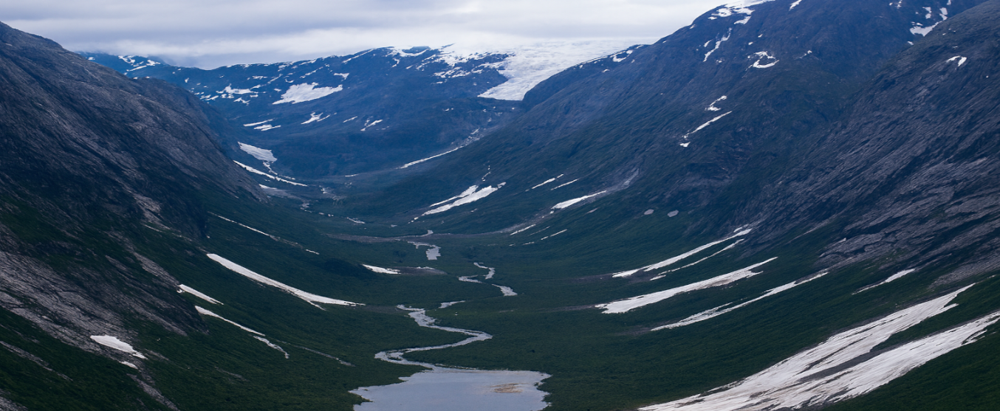
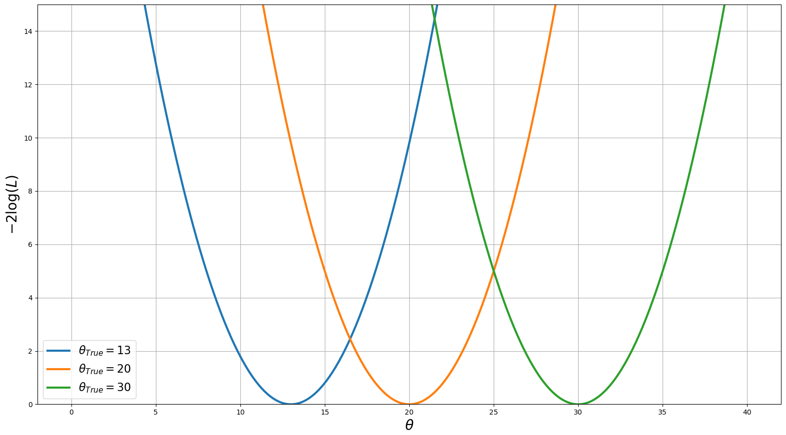
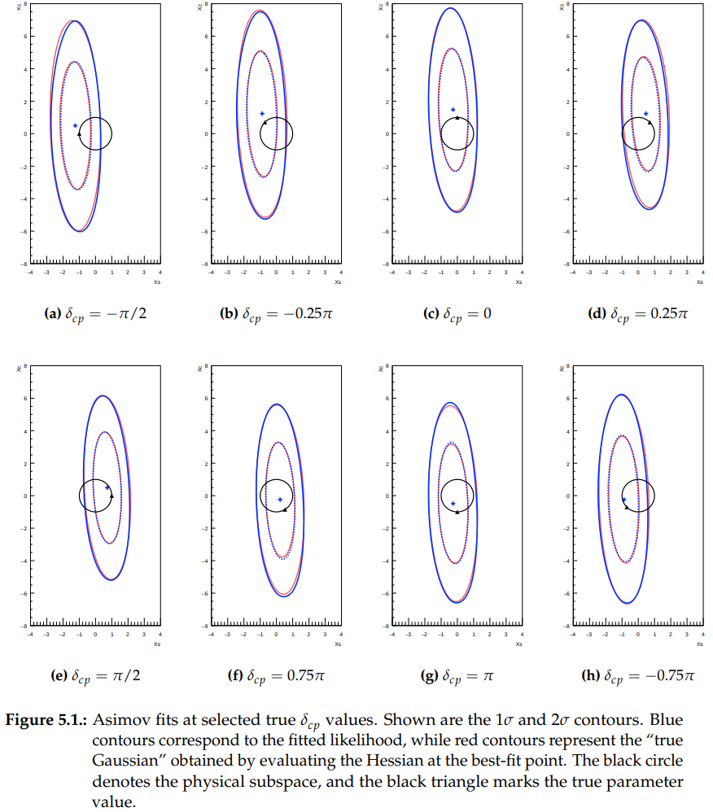
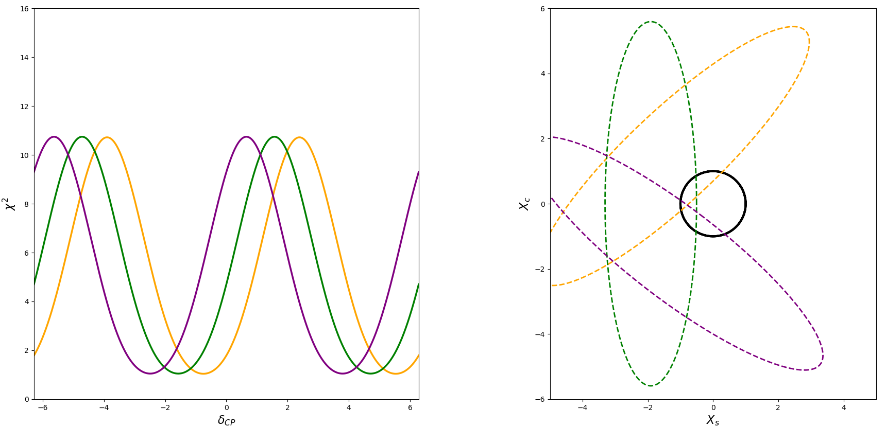

# Walking in circles in a complex valley: Understanding $\delta_{cp}$ sensitivity using $Xs-Xc$ space
The purpose of this description is to help develop an intuition for how fits performed in the extended $Xs-Xc$ space translate to the shape of the  $\delta_{cp}$ log-likelihood function.

## The problem
In typical analyses, experiments have sufficiently large statistics and perform fits within a regular parameter space, so the likelihood function approaches a well-known asymptotic distribution (usually Gaussian), whose width is determined by the experimental sensitivity and the degree to which the data model is understood. The actual fit then simply selects the best-fit value, while the overall likelihood shape remains independent of the particular value preferred by the data:

In neutrino oscillation experiments, the statistics for appearance events are typically very small. At these low event counts, the standard PMNS parametrisation exhibits irregularities that violate key assumptions required for the Gaussian approximation.

### Measuring  $\delta_{cp}$
Sensitivity to $\delta_{cp}$ is generated from distinct terms in the oscillation probability. Notably, we have CP-conserving (CPc) terms like $\cos\delta_{cp}$ and $\cos 2\delta_{cp}$, and a CP-violating (CPv) term $\sin\delta_{cp}$ (we can safely ignore $\cos 2\delta_{cp}$, as the contribution of this higher-order Fourier mode is negligible).

The sensitivity to the CPv term comes from comparing the $\nu_e$ and $\bar\nu_e$ samples, while sensitivity to the CPc term comes from the neutrino spectrum shape. Because these two pieces of information arise from different aspects of the fit, their individual contributions to the overall sensitivity to $\delta{cp}$ differ: the CPv term provides the dominant constraint, while the CPc term contributes subdominantly. As a result, the rate at which the predicted spectrum changes with $\delta_{cp}$, and thus the overall sensitivity, depends strongly on the true value of $\delta_{cp}$. When this intrinsic dependence is combined with additional effects such as marginalisation biases, physical boundaries (e.g. the upper limit on the appearance probability), and degeneracies inherent in the standard parametrisation, the shape of the likelihood function becomes highly sensitive to the true $\delta_{cp}$ value and can be very unintuitive. For instance, consider these two Asimov fits from T2K that assume trial p\Foints $\delta_{cp}=0$ and $\delta_{cp}=-\pi/2$, respectively:


I will not elaborate on this further here, but this behaviour complicates sensitivity studies and the characterization of certain systematic uncertainties that rely on understanding how the likelihood function changes. This remains a significant bottleneck in many neutrino oscillation analyses.

## Idea
The strategy employed in this framework is to construct an extended parameter space in which the physical subspace is embedded, while ensuring that the predicted event rates depend linearly on the extended parameters. Specifically, in the case of $\delta_{cp}$, it can be shown that the oscillation probability is linear in $sin\delta_{cp}$
and $cos\delta_{cp}$:

$$
\begin{aligned}
P(\nu_\mu \to \nu_e) &= A_{e\mu}\cos\delta_{cp} + B_{e\mu}\sin\delta_{cp} + C_{e\mu}, \\
P(\nu_\mu \to \nu_\mu) &\approx A_{\mu\mu}\cos\delta_{cp} + C_{\mu\mu}, \\
P(\nu_e \to \nu_e) &= C_{ee}.
\end{aligned}
$$

This offers a natural implementation by replacing the CPv and CPc terms with new parameters (Xs, Xc), which can vary independently. Therefore, the parameterisation becomes:

$$
\delta_{cp} \in [-\pi, \pi]
\quad \longrightarrow \quad
(X_s, X_c) \in \mathbb{R}^2.
$$

and the extended probability is:

$$
\begin{aligned}
P(\nu_\mu \to \nu_e) &= A_{e\mu}\,X_c + B_{e\mu}\,X_s + C_{e\mu}, \\
P(\nu_\mu \to \nu_\mu) &\approx A_{\mu\mu}\,X_c + C_{\mu\mu}, \\
P(\nu_e \to \nu_e) &= C_{ee}.
\end{aligned}
$$

In this extended parameterisation, the physical subspace corresponds to the points satisfying $f(X_s, X_c) = X_s^2 + X_c^2 = 1$ (**the unit circle**).

In this parameterisation, the likelihood is Gaussian, with its width independent of the true value of the parameter (up to the trivial and well-understood scaling that comes from the Poisson variance–mean relationship). Changing the assumed trial point therefore only shifts the centre of the best-fit point. The figure below shows the $2\sigma$ contour of the fit assuming different true $\delta_{cp}$ points, where the black unit circle defines the physical subspace:



``` [NOTE] this assumes that this Gaussian approximation remains accurate across the entire unit circle, which may not be true. This can limit the validity of this approach below a certain confidence threshold. However, this typically coincides with the level at which the experiment ceases to make meaningful statements anyway. ```

## Developing Intuition 
The remainder of this description is dedicated to demonstrating how the corresponding one-dimensional $\delta_{cp}$ log-likelihood can be readily understood by simply shifting the centre of the Gaussian from the $Xs-Xc$ fit and considering how it interacts with the physical circle.

Because the sensitivity to the CPv term ($Xs$ in this parameterisation) is much greater than the sensitivity to the CPc term ($Xc$), the resulting paraboloid in the extended space has a valley-like structure: the $Xs$ direction is steeply constrained, while the $Xc$ direction forms a much shallower slope. Since assuming a different best-fit trial point merely shifts the centre of this paraboloid around the circle, the trajectory traced on the likelihood surface changes accordingly.

Even in an idealised scenario where the experiment had equal sensitivity to the CPv and CPc terms, fit biases would still modify the effective shape. For example, marginalisation can pull the best-fit point away from the true values because the parameters of interest are strongly correlated with those being marginalised over. These effects alter how degeneracies and physical boundaries manifest for different true $\delta_{cp}$ values.

It is therefore straightforward to build intuition for both the origin of the 1D $\delta_{cp}$ likelihood shape and for why a trial-point dependence arises. Here we illustrate this using several animations and simple Python tools (all provided so you can can play with). In this extended parameter space, the fit yields a paraboloid, and the 1D $\delta_{cp}$ likelihood emerges from how the unitarity circle defined by $X_s^2 + X_c^2 = 1$ maps onto this surface. This mapping can be visualised by tracing around the circle. For the animations, one can imagine applying a circular “cookie-cutter’’ to the paraboloid and examining the resulting trace in the $\chi^2$ direction.


## Physical circle sits away from the valley ($|Xs|>1$)

The simplest case is when the physical subspace is away from the valley ($Xs > 1$ or $Xs < -1$). In this scenario, the circle sits on the steep $X_s$ walls of the paraboloid, and the one-dimensional $\delta_{cp}$ likelihood has a single maximum and a single minimum:


The larger the absolute value of $Xs$, the higher up the wall the physical circle will appear, the steeper the gradient will be, and the more extreme the difference between the minimum and the maximum will be.


As a special case, if the best-fit point lies exactly at $X_s = 1$ or $X_s = -1$ (corresponding to $\delta_{cp} = \pi/2$ or $\delta_{cp} = -\pi/2$, respectively), the minimum will sit in the valley, and the log-likelihood function in this region will be extremely flat.


## Physical circle sits in the valley ($|Xs|<1$)

If $|X_s| < 1$, then the physical circle sits across the valley of the paraboloid, and the one-dimensional $\delta_{cp}$ likelihood function will have multiple maxima and minima. Again, the framework makes these features easy to understand.


Notice the saddle shape that the physical circle cuts out in this case. The two maxima correspond to the locations of the highest points on the steep $Xs$ walls, while the three minima (there are technically only two, as $\pi$ and $-\pi$ represent the same point) correspond to the highest and lowest points on the shallow $Xc$ walls.


The $X_s$ best fit determines the relative heights of the two maxima in this case, with the next two animations generated using the same $X_c$ value but different $X_s$ values.


## Changing Xc

As the dominant constraint on $\delta_{cp}$, the major features of the one-dimensional $\delta_{cp}$ likelihood are determined by where the physical circle lies on the steep $Xs$ wall. Changing the $Xc$ best-fit location alters which of the CPc solutions (either $\cos(\delta = \pi) = 1$ or $\cos(\delta = 0) = -1$) is preferred, which has the effect of changing which half of the circle lies higher on the shallow $Xc$ walls. This, in turn, introduces a skew in the one-dimensional $\delta_{cp}$ likelihood.

If we again consider the $Xs = 1$ or $Xs = -1$ scenario, but this time with $Xc$ far off the physicsal circle.


Here we see that the likelihood values for the CPc solutions are no longer equal, as one occupies a steeper part of the valley. Also note how the flat section is now skewed/tilted in the direction of whichever CPc solution is favoured.

If we again consider the $|Xs| < 1$ case (so that the physical circle lies across the valley), the value of $Xc$ changes the minima:


And we can also show this with an $Xs$ offset too.


## Xs-Xc Correlation 
It is possible for there to be a correlation between Xs and Xc in some experiments. The effect of this is to rotate the direction of the “valley base,” and therefore the direction in which it partitions the physical circle. In the case of no correlation, the valley is oriented perpendicular to the direction of the CPv solutions; rotations introduced by Xs–Xc correlation alter this perpendicular direction. Consequently, the previously discussed features are exactly the same, but they now occur at a different phase.



## Interactive tool
I hope this has highlighted the utility of the Xs–Xc approach, and how it allows one to obtain the Xs and Xc sensitivities from a single fit that produces a paraboloid log-likelihood. It also provides an intuitive way to understand what the corresponding one-dimensional $\delta_{cp}$ log-likelihood will look like by simply moving the best-fit point relative to the physical circle. I have also included an interactive Python tool that allows you to set the shape of the Xs–Xc log-likelihood surface and then move the circle around on it, showing in real time the corresponding $\delta_{cp}$ log-likelihood (code here: https://github.com/PaulMorrison-98/Understanding_the_Dcp_likelihood_using_XsXc_space/blob/main/Interactive_tool.py). Because the script works by moving the circle rather than the paraboloid, the values are not marked to avoid confusion.

https://github.com/user-attachments/assets/f6a6d680-5185-4886-9e99-fd826f9dc5e9

https://github.com/user-attachments/assets/bc5aeb5d-ca3c-4045-8336-b6e78aad3ca5


